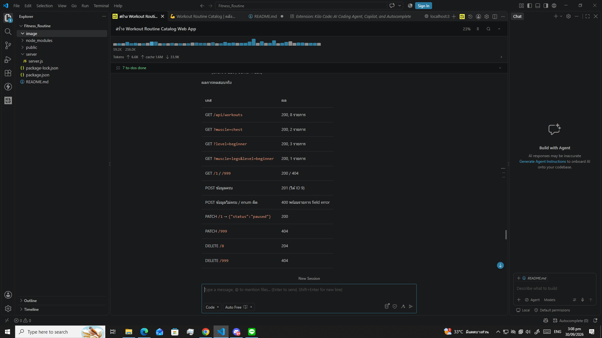
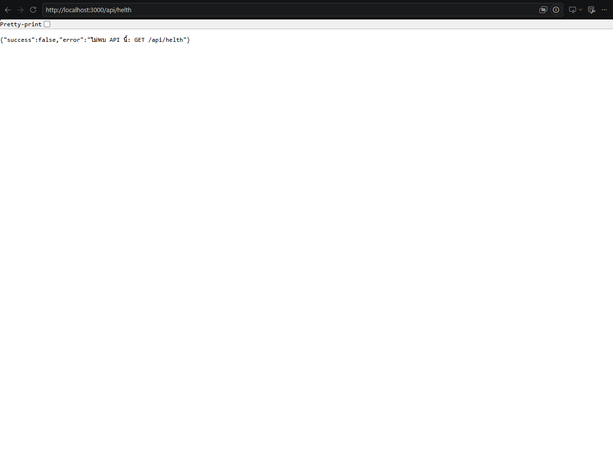

# Workout Routine Catalog 🏋️

> โปรเจกต์สำหรับวิชา **Full-stack Web Development**
> ระบบจัดการตารางออกกำลังกาย (Workout Routine Catalog) — REST API แบบ CRUD เต็มรูปแบบ
## ข้อมูลรายชื่อสมาชิก
ชิษณุพงศ์ เจริญฐิติรัตน์ 660910488
ศิรวัฒน์ มกรกิจวิบูลย์ 660910505
ชินภัทร ศุภพฤกษ์พงศ์ 660910538

## หลักฐานการดีบัก
### Debug 1 - API Health


### Debug 2 - ผลการทดสอบระบบ


## 1. ภาพรวมโปรเจกต์ (Project Overview)

| รายการ | รายละเอียด |
| --- | --- |
| **หัวข้อ** | Workout Routine Catalog — ระบบจัดการตารางออกกำลังกาย |
| **Backend** | Node.js + Express (REST API, In-Memory Database) |
| **Frontend** | HTML5 + CSS3 + Vanilla JavaScript (Fetch API / AJAX) |
| **ฐานข้อมูล** | Memory DB (ตัวแปร Array ในเซิร์ฟเวอร์) พร้อม Seed Data 8 รายการ |
| **External API** | ไม่มี — ใช้งานเฉพาะ API ของตัวเองเท่านั้น |
| **Port** | `3000` (เปลี่ยนได้ผ่าน `PORT` env) |

### ฟีเจอร์หลัก

**ฝั่ง Server**
- REST API ครบ 5 CRUD endpoints
- กรองข้อมูลด้วย query parameter (`?muscle=`, `?level=`, `?equipment=`, `?status=`, `?q=`)
- ตรวจสอบข้อมูล (Validation) คืน `400` เมื่อข้อมูลไม่ครบถ้วน/ผิดรูปแบบ
- คืน `404` เมื่อไม่พบรายการ, คืน `201` เมื่อสร้างสำเร็จ, คืน `204` เมื่อลบสำเร็จ
- Seed Data ตั้งต้น 8 ท่า (Push-up, Bench Press, Squat, Pull-up, Plank, Deadlift, Burpee, Lunges)
- Endpoint เสริม `GET /api/meta` สำหรับดึงค่า enum ที่ใช้สร้าง Dropdown

**ฝั่ง Client**
- **Presets Select** — คลังท่าสำเร็จรูป 10 ท่า (Dropdown + Chip) กดแล้วเติมฟอร์มอัตโนมัติ
- ฟอร์มเพิ่ม/แก้ไขรายการ พร้อม Validate ทั้งฝั่ง Client และ Server
- อัปเดตรายการทันทีด้วย Fetch API (ไม่ต้องรีเฟรชหน้า)
- ตัวกรองตามกลุ่มกล้ามเนื้อ / ระดับความยาก / สถานะ + ช่องค้นหา
- การ์ดแสดงผลสวยงาม พร้อม Badge แยกสีตามกลุ่มกล้ามเนื้อและระดับความยาก
- ปุ่มเปลี่ยนสถานะ/แก้ไข (PATCH) และปุ่มลบ (DELETE) พร้อม Modal ยืนยันการลบ
- Toast Notification + Responsive UI (Mobile friendly) + Design Token + Dark Fitness Theme

---

## 2. โครงสร้างโฟลเดอร์ (Project Structure)

```
Fitness_Routine/
├── package.json          # ตัวกำหนด dependencies & npm scripts
├── README.md             # เอกสารโปรเจกต์
├── server/
│   └── server.js         # Express server + REST API + Memory DB + Seed Data
└── public/
    ├── index.html        # โครงสร้างหน้า UI (ฟอร์ม, filter, การ์ดรายการ)
    ├── style.css         # สไตล์ธีม Fitness App (Dark + Neon Lime)
    └── app.js            # Vanilla JS: Presets, Fetch CRUD, Render, Toast
```

### Data Schema

```jsonc
{
  "id": 1,                          // เลข ID (สร้างอัตโนมัติ)
  "name": "Push-up",                // ชื่อท่า (required)
  "muscle": "chest",                // chest|back|legs|core|shoulders|arms|full-body (required)
  "level": "beginner",              // beginner|intermediate|advanced (required)
  "equipment": "bodyweight",        // อุปกรณ์ (required)
  "sets": 3,                        // จำนวนเซ็ต 1-20 (required)
  "reps": 12,                       // จำนวนครั้ง 1-200 (required)
  "duration": 0,                    // วินาทีที่ค้าง (optional, 0 = นับ reps)
  "description": "...",             // วิธีทำ (required)
  "status": "active",               // active|paused|archived (optional, default active)
  "createdAt": "2026-01-05T08:00:00.000Z"
}
```

---

## 3. วิธีติดตั้ง (Installation)

> ต้องมี [Node.js](https://nodejs.org) เวอร์ชัน **18 ขึ้นไป** และ npm

```bash
# 1) เข้าไปในโฟลเดอร์โปรเจกต์
cd Fitness_Routine

# 2) ติดตั้ง dependency (express)
npm install
```

---

## 4. วิธีรัน (Running)

```bash
# แบบที่ 1 — รันปกติ
npm start

# แบบที่ 2 — โหมด dev (auto restart เมื่อแก้ไฟล์ server/server.js)
npm run dev
```

เมื่อรันสำเร็จจะเห็นข้อความใน Terminal:

```
============================================================
  Workout Routine Catalog API
  Server running at: http://localhost:3000
  Client (UI)      : http://localhost:3000
  Seed data loaded : 8 รายการ
============================================================
```

จากนั้นเปิดเบราว์เซอร์ไปที่ **http://localhost:3000**

> เปลี่ยน Port: `$env:PORT=4000; npm start` (Windows PowerShell)

> **หมายเหตุ:** เนื่องจากใช้ Memory DB ข้อมูลจะกลับมาเป็น Seed Data เมื่อปิด-เปิดเซิร์ฟเวอร์ใหม่

---

## 5. สรุป REST API Endpoints

Base URL: `http://localhost:3000/api`

| Method | Endpoint | คำอธิบาย | รหัสตอบกลับ |
| --- | --- | --- | --- |
| **GET** | `/api/workouts` | ดึงท่าทั้งหมด (รองรับ filter) | `200 OK` |
| **GET** | `/api/workouts/:id` | ดึงข้อมูลตาม ID | `200 OK` / `404 Not Found` |
| **POST** | `/api/workouts` | เพิ่มท่าใหม่ | `201 Created` / `400 Bad Request` |
| **PATCH** | `/api/workouts/:id` | แก้ไขข้อมูลบางส่วน | `200 OK` / `404 Not Found` / `400 Bad Request` |
| **DELETE** | `/api/workouts/:id` | ลบรายการ | `204 No Content` / `404 Not Found` |
| **GET** | `/api/meta` | ค่า enum สำหรับสร้าง Dropdown (เสริม) | `200 OK` |

### Query Parameters ของ `GET /api/workouts`

| พารามิเตอร์ | ค่าที่รับได้ | ตัวอย่าง |
| --- | --- | --- |
| `muscle` | chest, back, legs, core, shoulders, arms, full-body | `/api/workouts?muscle=chest` |
| `level` | beginner, intermediate, advanced | `/api/workouts?level=beginner` |
| `equipment` | อิสระ (bodyweight, barbell, ...) | `/api/workouts?equipment=barbell` |
| `status` | active, paused, archived | `/api/workouts?status=active` |
| `q` | คำค้นหา (ชื่อ/รายละเอียด/อุปกรณ์) | `/api/workouts?q=squat` |

> รองรับการกรองหลายเงื่อนไขพร้อมกัน เช่น `/api/workouts?muscle=legs&level=beginner`

---

## 6. ตัวอย่างการเรียก API (ตัวอย่างคำสั่ง)

### GET — ดึงข้อมูลทั้งหมด / กรอง

```bash
curl http://localhost:3000/api/workouts
curl "http://localhost:3000/api/workouts?muscle=chest"
curl "http://localhost:3000/api/workouts?level=beginner"
curl "http://localhost:3000/api/workouts?muscle=legs&level=beginner"
```

### GET — ดึงตาม ID

```bash
curl http://localhost:3000/api/workouts/1
curl http://localhost:3000/api/workouts/999   # -> 404 Not Found
```

### POST — เพิ่มท่าใหม่

```bash
curl -X POST http://localhost:3000/api/workouts `
  -H "Content-Type: application/json" `
  -d "{\"name\":\"Dumbbell Curl\",\"muscle\":\"arms\",\"level\":\"beginner\",\"equipment\":\"dumbbell\",\"sets\":3,\"reps\":12,\"description\":\"งอแขนขึ้นให้ดัมเบลถึงหน้าอก แล้วปล่อยช้า ๆ\"}"
```

### POST — ข้อมูลไม่ครบ (ต้องได้ 400)

```bash
curl -X POST http://localhost:3000/api/workouts `
  -H "Content-Type: application/json" `
  -d "{\"name\":\"Test\"}"
```

### PATCH — แก้ไขข้อมูล

```bash
# เปลี่ยนสถานะ
curl -X PATCH http://localhost:3000/api/workouts/1 `
  -H "Content-Type: application/json" `
  -d "{\"status\":\"paused\"}"

# แก้ไขหลายฟิลด์
curl -X PATCH http://localhost:3000/api/workouts/2 `
  -H "Content-Type: application/json" `
  -d "{\"sets\":5,\"reps\":5,\"level\":\"advanced\"}"
```

### DELETE — ลบรายการ

```bash
curl -X DELETE http://localhost:3000/api/workouts/8   # -> 204 No Content
curl -X DELETE http://localhost:3000/api/workouts/999 # -> 404 Not Found
```

### ตัวอย่าง Response

```jsonc
// GET /api/workouts?muscle=chest  -> 200 OK
{
  "success": true,
  "count": 2,
  "filters": { "muscle": "chest", "level": "all", "equipment": "all", "status": "all", "q": "" },
  "data": [ /* ... */ ]
}

// POST ข้อมูลไม่ครบ -> 400 Bad Request
{
  "success": false,
  "error": "ข้อมูลที่ส่งมาไม่ครบถ้วนหรือไม่ถูกต้อง",
  "fields": ["ฟิลด์ \"muscle\" เป็นข้อมูลจำเป็นและห้ามเว้นว่าง"]
}

// GET /api/workouts/999 -> 404 Not Found
{ "success": false, "error": "ไม่พบท่าออกกำลังกาย ID: 999" }
```

---

## 7. เทคโนโลยีที่ใช้ (Tech Stack)

**Backend**
- `Node.js` (v18+) — Runtime
- `Express` v4 — Web Framework & Routing
- `express.json()` — Body Parser
- `In-Memory Array` — ฐานข้อมูลจำลอง
- CORS Header (Manual) — ให้ทดสอบ API ข้ามเครื่องได้

**Frontend**
- HTML5 Semantic + ARIA
- CSS3 — CSS Variables (Design Tokens), Grid/Flexbox, Animation, Responsive
- Vanilla JavaScript (ES2015+) — `fetch()`, `async/await`, `URLSearchParams`, Event Delegation
- ไม่มี External API / ไม่มี Framework ไม่มี CDN dependency

---

## 8. การออกแบบฐานข้อมูล & การจัดการ Validation

**Memory DB:** เก็บข้อมูลในตัวแปร `workouts` (Array of Object) + ตัวนับ `nextId`
- Seed Data ถูกโหลดครั้งแรกที่เซิร์ฟเวอร์เริ่มทำงาน (8 รายการ)
- ID ใช้ระบบเลขจำนวนเต็มแบบ Auto Increment

**Validation 2 ชั้น (Defense in Depth)**
1. **Client-side (`public/app.js`)** — ตรวจช่องบังคับ, ชนิดข้อมูล, ช่วงตัวเลข ก่อนส่ง
2. **Server-side (`server/server.js` → `validateWorkout()`)** — ตรวจซ้ำฝั่งเซิร์ฟเวอร์ (เชื่อถือได้จริง)
   - ฟิลด์บังคับ: `name`, `muscle`, `level`, `equipment`, `sets`, `reps`, `description`
   - Enum: `muscle`, `level`, `status` ต้องเป็นค่าที่ระบบกำหนด
   - ช่วงตัวเลข: `sets` 1-20, `reps` 1-200, `duration` ≥ 0
   - ความยาว: `name` ≤ 80 ตัวอักษร, `description` ≤ 500 ตัวอักษร

---

## 9. แนวทางการทดสอบ (Testing Checklist)

| # | กรณีทดสอบ | ผลลัพธ์ที่คาดหวัง |
| --- | --- | --- |
| 1 | เปิด `http://localhost:3000` | เห็นการ์ด Seed Data 8 รายการ |
| 2 | เลือก Preset "Squat" จาก Chip | ฟอร์มเต็มข้อมูลอัตโนมัติ |
| 3 | กดบันทึกโดยยังไม่กรอกข้อมูล | Toast แจ้งเตือน + ช่องชื่อถูกไฮไลต์ |
| 4 | กรอกครบแล้วบันทึก | Toast "เพิ่มสำเร็จ" + การ์ดใหม่ปรากฏทันที ไม่รีเฟรช |
| 5 | เลือก filter Chest | เหลือเฉพาะรายการกลุ่มอก |
| 6 | พิมพ์คำค้น "squat" | เหลือเฉพาะ Squat (debounce 350ms) |
| 7 | กด "เปลี่ยนสถานะ" | สถานะเปลี่ยน active → paused → archived |
| 8 | กด "แก้ไข" → เปลี่ยนค่า → บันทึก | ข้อมูลในการ์ดเปลี่ยน (PATCH) |
| 9 | กด "ลบ" | Modal ยืนยัน → การ์ดหายไป (204) |
| 10 | `curl /api/workouts/999` | 404 Not Found |
| 11 | POST ข้อมูลไม่ครบ | 400 Bad Request |
| 12 | ปิด-เปิดเซิร์ฟเวอร์ | ข้อมูลกลับเป็น Seed Data 8 รายการ |

---

## 11. ปัญหาที่พบบ่าง (Known Issues & Future Improvements)

**ข้อจำกัดของเวอร์ชันนี้**
- ใช้ In-Memory DB ข้อมูลหายทั้งหมดเมื่อปิดเซิร์ฟเวอร์
- ไม่มีระบบ Authentication / Authorization
- ไม่มี Pagination (เหมาะกับข้อมูลจำนวนไม่มาก)

**แนวทางพัฒนาต่อ**
- เชื่อมฐานข้อมูลจริง (MongoDB / MySQL) แทน Memory DB
- เพิ่มระบบ Login และแยกสิทธิ์ผู้ใช้
- เพิ่ม Pagination, Sorting (`?sort=name&order=asc`)
- เพิ่มการอัปโหลดรูปภาพประจำท่า
- เพิ่ม Unit Test / Integration Test (Jest + Supertest)
- แยกโครงสร้างไฟล์ตาม MVC Architecture

---


---

## License

MIT License — ใช้เพื่อการศึกษาเท่านั้น
